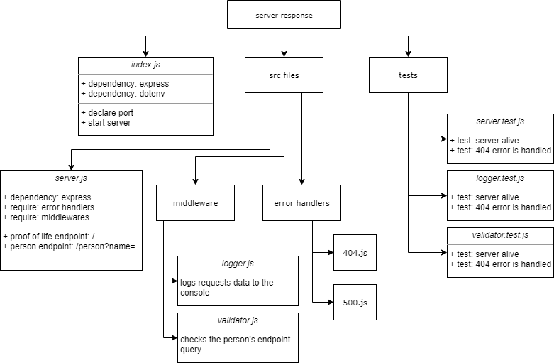

# basic-express-server

## Description

This is a basic Express.js server that responds a JSON object with the name value in it sent as a query in the `/person` route GET request. The server implements a modularized structure, middleware, and jest tests.

## Links

* Heroku deployment: https://hasnaa-basic-express-server.herokuapp.com/
* /person route working Heroku link: https://hasnaa-basic-express-server.herokuapp.com/person?name=hasnaa
* 404 error link: https://hasnaa-basic-express-server.herokuapp.com/pirson?name=hasnaa
* 500 error links: https://hasnaa-basic-express-server.herokuapp.com/person?name=, https://hasnaa-basic-express-server.herokuapp.com/person?name=1hasnaa
* Pull request from dev to main: https://github.com/hasnaa38/basic-express-server/pull/1

## UML

